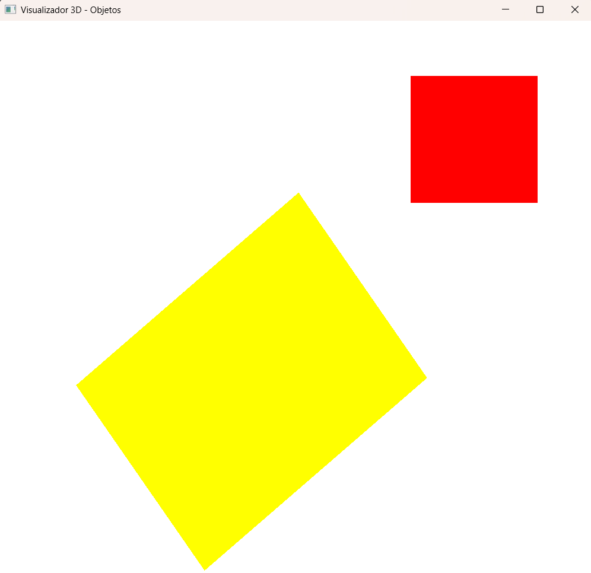

# Grupo

Gabriel Figueiredo

## Tarefa - Criando o ambiente de Programação de cenas 3D

### Modulo 1: src/modulo1/Modulo1_Hello3D.cpp

Tarefa: https://www.moodle.unisinos.br/mod/assign/view.php?id=940370

App:

### Modulo 2: src/modulo2/Modulo2_Cubo.cpp

Tarefa: https://www.moodle.unisinos.br/mod/assign/view.php?id=940393&action=editsubmission

Teclas:

R: Rotaciona
A, D: Direita e esquerda
I,K: Cima baixo
W,S: frente, tras
´,[: Dimensoes.

App:

