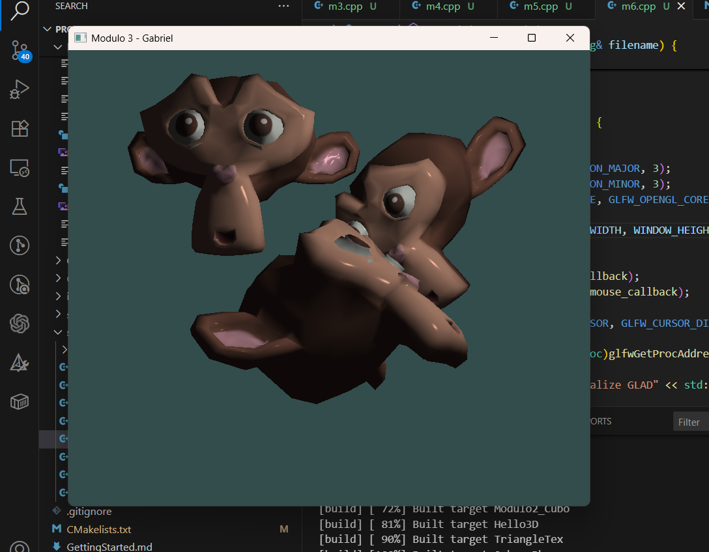
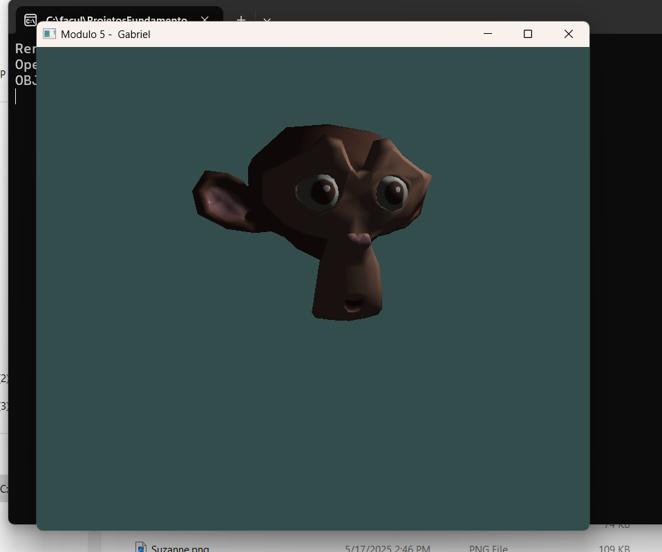
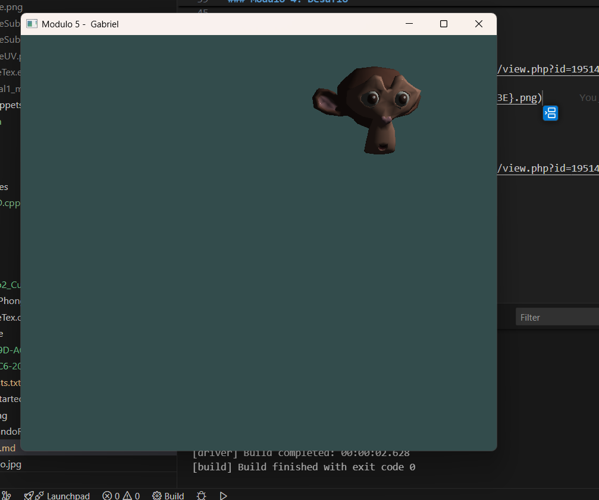

# Grupo

Gabriel Figueiredo

## Tarefa - Criando o ambiente de Programação de cenas 3D

### Modulo 1: Desafio

- Arquivo Hello3D.cpp
- Tarefa: https://www.moodle.unisinos.br/mod/assign/view.php?id=940370

App:

### Modulo 2: Desafio

- Arquivo: Modulo2_Cubo.cpp
- Tarefa: https://www.moodle.unisinos.br/mod/assign/view.php?id=940393&action=editsubmission

Teclas:

R: Rotaciona
A, D: Direita e esquerda
I,K: Cima baixo
W,S: frente, tras
´,[: Dimensoes.
N: Instancia um novo cubo

- App:

### Modulo 3: Desafio

- Arquivo: m4.cpp
- Tarefa: https://www.moodle.unisinos.br/course/view.php?id=19514&section=16#tabs-tree-start

### Modulo 4: Desafio

- Arquivo: m4.cpp
- Tarefa: https://www.moodle.unisinos.br/course/view.php?id=19514&section=21#tabs-tree-start

### Modulo 5: Desafio

- Arquivo: m5.cpp
- Tarefa: https://www.moodle.unisinos.br/course/view.php?id=19514&section=25#tabs-tree-start

### Modulo 6: Desafio

- Arquivo: m6.cpp
- Tarefa: https://www.moodle.unisinos.br/course/view.php?id=19514&section=30#tabs-tree-start
